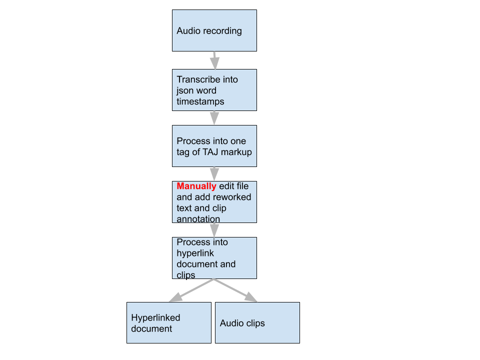

# Text-from-Audio-for-Justice
Takes an audio recording and transcribes it into text document so that an user can annotate it.  The app then can process the annotated document into audio clips and a document with hyper-links to the clips.



### General Use
```bash
usage: taj [-h] [--audio_output AUDIO_OUTPUT] [--validate] [--audio_output AUDIO_OUTPUT] 
                [--audio_source AUDIO_SOURCE] [--transcript TRANSCRIPT] [--markup_file MARKUP_FILE] [--split_sentences MARKUP_FILE] etc
                {transcribe, chunk, make_markup, word}

positional arguments:
  {transcribe, chunk, make_markup, word}

  transcribe
        --audio_source          path of audio to process
        --transcription_output  path for transcription file output

  word
        --markup_file           path of markup_file
        --audio_output_chunks   path to name of output chunks
        --word_output_file      path of word output file
        --online_folder         http url of folder of audio_files
  
  chunk
        --audio_source          path of audio to process
        --audio_output          output path for chunk files
        --transcript            path of timecoded json transcript (or default)
        --markup_file           path of markup_file

  make_markup
        --markup_file           path of markup_file
        --split_sentences       path of auto-generated markup split at sentences

optional arguments:
  -h, --help                                show this help message and exit
  -v, --validate                            validate created transcript before building audio chunks
  -o, --audio_output AUDIO_OUTPUT           output path for chunk files
  -d, --transcription_output TRANS_OUTPUT      output path for MS Word file
  -s, --audio_source AUDIO_SOURCE           input path to the audio file to chunk. Must have  either mp3 or wav extension
  -t, --transcript TRANSCRIPT               input path of Kaldi transcript file
  -m, --markup_file MARKUP_FILE             output path of taj markup file
  -n, --split_sentences MARKUP_FILE         output path of auto-generated markup split at sentences
  -c, --audio_output_chunks CHUNK_NAME      path to name of output chunks
  -w, --word_output_file WORD_OUTPUT        path of word output file
  -f, --online_folder                       http url of folder of audio_files
```

The word document produced is in an old format, MS Word can open it but it needs to be converteted to read in google.
Use [cloud convert](https://cloudconvert.com/) in 'open with' to convert to google docs.
To format hyperlinks in Google Docs use add-on [Link Style from G Suite Marketplace](https://gsuite.google.com/marketplace/app/link_style/430151409905?pann=cwsdp&hl=en-GB)